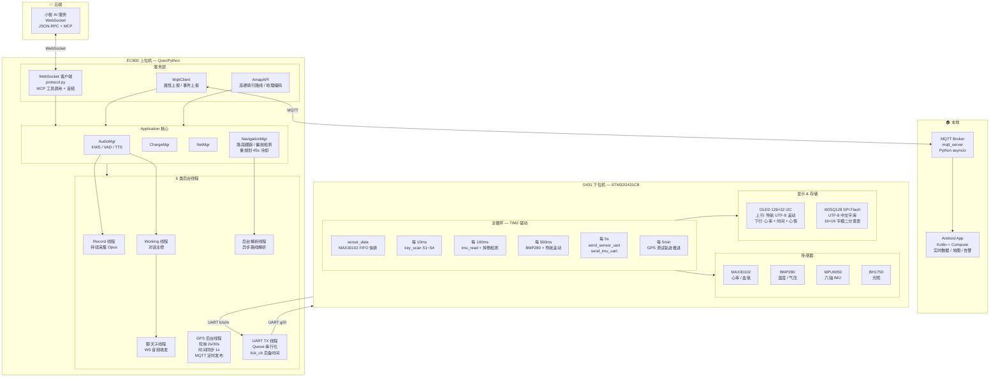

# Smart Helmet — 智能头盔语音助手系统

基于 Quectel EC800 模组的嵌入式智能头盔方案，支持语音唤醒对话、骑行导航、MQTT 远程监控。

## 项目结构

```
├── src/                    # 上位机 (QuecPython / EC800 模组)
│   ├── _main.py            # 主入口 + MCP 工具 + 导航 + MQTT
│   ├── mqtt_client.py      # MQTT 客户端
│   ├── protocol.py         # WebSocket 协议 (JSON-RPC + 音频)
│   ├── utils.py            # 音频/充电/网络/串口/UART 收发
│   ├── helmet_test.py      # 高德 API + 导航 (AmapAPI/Navigator)
│   ├── logging.py          # 日志系统
│   └── readme.md           # 📖 嵌入式端详细文档
├── G431/                   # 下位机 (STM32G431CB + Keil MDK)
│   ├── Core/               # HAL 初始化
│   ├── BSP/                # 传感器/OLED/W25Q128 字库驱动
│   ├── Drivers/            # CMSIS + HAL 库
│   └── MDK-ARM/            # Keil 工程文件
├── mqtt_server/            # MQTT Broker (Python asyncio)
│   ├── broker.py           # Broker 核心
│   ├── data_handler.py     # 数据处理管道 (validate→threshold→persist)
│   ├── config.py           # 配置中心 (设备密钥/阈值/主题路由)
│   └── run.py              # 启动入口
├── android_app/            # Android 监控 App (Kotlin + Compose)
│   └── app/src/main/java/com/helmet/monitor/
├── tests/                  # 测试工具
│   └── uart_slave_simulator.py  # 串口下位机模拟器 (Python)
├── fw/                     # EC800 固件
├── start_mqtt.bat          # Windows 一键启动 Broker
└── CHANGELOG.md            # 更新日志
```

## 系统架构



> 架构图源码见 `tools/gen_arch_diagram.py`（Mermaid 格式，GitHub 原生渲染）

## 快速开始

### 1. 启动 MQTT Broker

```bash
# Windows: 双击 start_mqtt.bat
# Linux/macOS:
cd mqtt_server && python run.py
```

### 2. 模拟设备数据

```bash
pip install pyserial
python tests/uart_slave_simulator.py COM3
# GPS 由上位机请求驱动（无需手动操作），按 d 开始传感器上报
```

### 3. Android App

用 Android Studio 打开 `android_app/`，Sync → Run。

连接地址见 `MqttManager.kt`：
- 本地模拟器: `tcp://10.0.2.2:1883`
- 内网穿透: `tcp://frp-run.com:18830`

## MQTT 主题

| 主题 | 方向 | 用途 |
|------|------|------|
| `helmet/{id}/attributes` | 设备→服务器 | 属性上报 (GPS/体温/心率) |
| `helmet/{id}/events` | 设备→服务器 | 事件上报 (上线/离线) |
| `helmet/{id}/data/processed` | 服务器→App | 管道处理后数据 |
| `helmet/{id}/alerts` | 服务器→App | 告警消息 |
| `helmet/{id}/commands` | App→设备 | 下行指令 |

## 技术栈

| 层 | 方案 |
|----|------|
| 上位机 | QuecPython + EC800 4G 模组 |
| 下位机 | STM32G431CB + HAL 库 (Keil MDK) |
| MQTT Broker | Python asyncio (自研) |
| Android | Kotlin + Jetpack Compose + Paho MQTT |
| 地图 | 高德 3D Map SDK (原生 GL) |
| 保活 | Android Foreground Service |
| 穿透 | frp (内网穿透) |

## Android App 功能

- 实时数据卡片（温度 / 心率 / 气压 / GPS 坐标）
- 高德 3D 地图 + 蓝点定位 + 轨迹折线 + 自动跟随
- 告警通知栏推送 + **系统闹铃剧响**（10 秒循环）
- **前台服务保活**，退到后台不杀进程
- MQTT 断线自动退避重连（2s→4s→8s→60s）
- 传感器数据 JSONL 本地持久化 + 趋势图表
- 温度 > 40°C 红色预警（环境温度检测）

## G431 下位机功能

- **传感器采集**：BH1750（光照）、BMP280（温度/气压）、MPU6050（六轴 IMU）、MAX30102（心率/血氧）
- **OLED 128×32 显示**：双行布局（导航文字滚动 + 时间/心率/心情），UTF-8 中文字库（W25Q128 SPI Flash）
- **摔倒/碰撞检测**：合加速度 > 3g 或 角速度 > 300°/s 即时告警
- **双机握手协议**：上电 `i<hex>` 传感器状态上报，EC800 回复 `i` 启动采集
- **测试模式**（默认开启）：模拟 GPS 轨迹 + 模拟传感器数据
- **4 键输入**：开关机 / 对话 / 音量 ±，每 10ms 扫描

## 更多文档

嵌入式端（EC800 模组）的完整技术文档见 **[src/readme.md](src/readme.md)**，涵盖：

- 核心线程模型（6 类线程协作）
- MCP 工具扩展指南
- 串口通信协议规范（报文帧格式、模块简写表、交互模式）
- GPS 定位与实时导航（偏航检测、路段跟踪、自动重规划）
- MQTT 云平台集成（保活、上报链路）
- 音频管理（KWS/VAD/TTS 回调队列）
