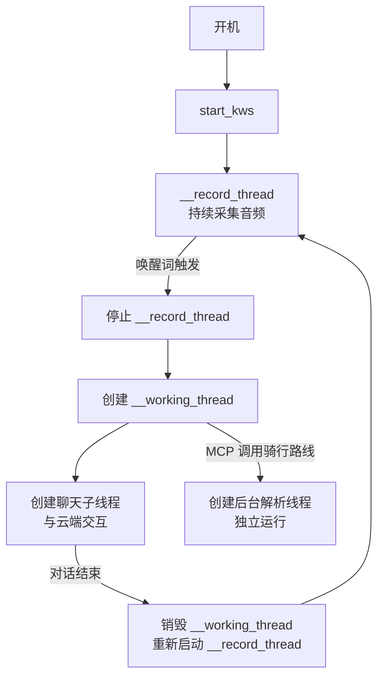
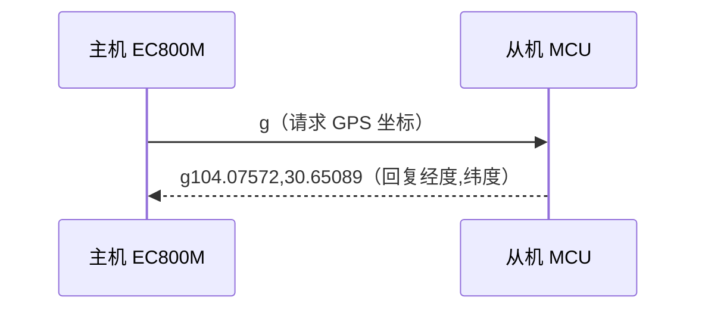
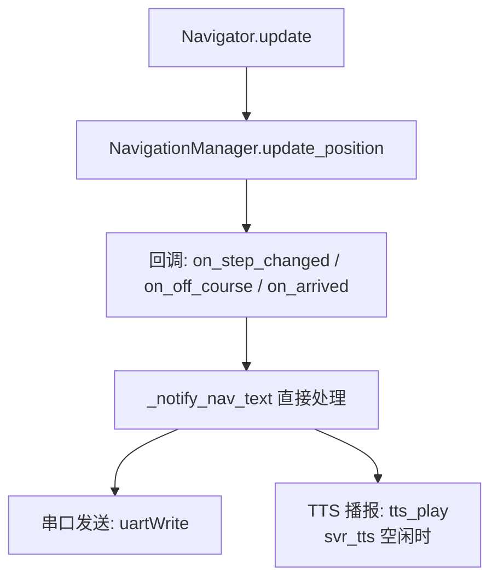
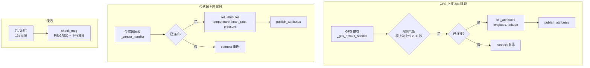
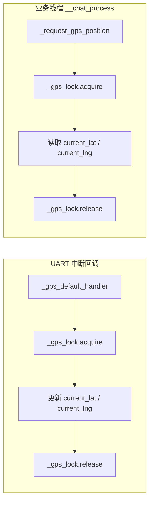

# 智能头盔/语音助手项目 README（基于 EC800 系列模组）

## 1. 项目概述

本项目是一个基于 **Quectel EC800 无线通信模组**（如 EC800N、EC800M）的嵌入式语音助手系统，运行 QuecPython（MicroPython）环境。它支持：

- 离线语音唤醒（KWS）与语音活动检测（VAD），最多支持 3 个唤醒词
- 云端 WebSocket 实时语音对话
- 音频播放与录制（Opus 编解码）
- 本地 TTS 语音合成（用于导航指令等离线播报）
- 充电管理与电源控制
- GPS/北斗定位数据解析与主动轮询
- 按键交互（音量调节、唤醒、开关机）
- 串口通信扩展（支持自定义命令）
- MCP 工具调用（音量控制、唤醒词改名、骑行路线查询、导航启停等）
- OTA 升级（获取 WebSocket 连接参数）
- 实时骑行导航（路段跟踪、偏航检测、到达提醒）
- 高精度球面几何计算（点到折线最近距离、方位角等）
- sys_bus 事件总线（模块间解耦通信）
- MQTT 云平台集成（属性上报、事件上报、下行指令接收）
- 6 路 LED 指示灯（网络状态、AI 对话、电源状态）

项目适用于 **智能头盔、智能音箱、AI 对话盒子** 等场景。

---

## 2. 项目目录结构

```
solution-xiaozhiAI/
├── src/                    # 上位机 (QuecPython / EC800)
│   ├── _main.py            # 主入口，Application 核心类
│   ├── helmet_test.py      # 高德 API + 导航 (AmapAPI / Navigator / NavigationManager)
│   ├── mqtt_client.py      # MQTT 客户端 MqttClient
│   ├── protocol.py         # WebSocket 协议 (JSON-RPC + MCP + 音频)
│   ├── utils.py            # 音频/充电/网络/串口/命令分发 (Massage / CommandDispatcher)
│   ├── logging.py          # 日志系统
│   ├── threading.py        # 并发原语 (MicroPython)
│   ├── OTA_test.py         # OTA 升级接口
│   ├── uuid.py             # UUID v4 生成
│   └── readme.md           # 📖 本文件
├── G431/                   # 下位机 (STM32G431CB + Keil MDK)
│   ├── Core/               # HAL 初始化 (main.c, spi.c, usart.c, gpio.c, stm32g4xx_it.c)
│   ├── BSP/                # 板级支持包
│   │   ├── func.c/h        # 主循环 + 传感器采集 + 按键 + 串口协议 + 导航滚动
│   │   ├── OLED/           # SSD1306 128×32 I2C 驱动
│   │   ├── W25Q128/        # SPI Flash 驱动
│   │   ├── utf8_font/      # UTF-8 中文字库 (W25Q128 二分查表)
│   │   ├── MAX30102/       # 心率血氧传感器
│   │   ├── BMP280/         # 温度气压传感器
│   │   ├── MPU6050/        # 六轴 IMU
│   │   └── BH1750/         # 光照传感器
│   ├── Drivers/            # CMSIS + HAL 库
│   └── MDK-ARM/            # Keil 工程文件
├── mqtt_server/            # MQTT Broker (Python asyncio)
├── android_app/            # Android 监控 App (Kotlin + Compose)
├── tests/                  # 测试工具 (uart_slave_simulator.py)
├── fw/                     # EC800 固件
└── CHANGELOG.md            # 更新日志
```

## 2.1 EC800 源码目录

```
src/
├── _main.py           # 主程序入口，Application 核心类
├── helmet.py          # 高德地图 API 封装（天气、地理编码、骑行导航路径解析）
├── helmet_test.py     # 增强版高德地图 API（含 Navigator、NavigationManager、球面几何算法）
├── logging.py         # 日志系统（支持等级、线程安全，debug=False 过滤刷屏）
├── OTA_test.py        # OTA 升级接口（获取 WebSocket 服务器地址与 token）
├── protocol.py        # WebSocket 客户端协议实现（JSON-RPC + MCP + 通知）
├── mqtt_client.py     # MQTT 客户端 MqttClient（属性上报、事件上报、下行指令）
├── threading.py       # 线程、锁、条件变量、事件、信号量、队列、线程池等并发原语
├── utils.py           # 工具类：音频管理、充电管理、网络管理、任务调度、按键、串口、命令分发器
├── uuid.py            # UUID v4 生成
├── audio_gain.nvm     # 音频增益校准文件
└── audio_ve.nvm       # 音频 VE 校准文件
```

---

## 3. 整体代码框架

### 3.1 启动流程

1. 创建 `Application` 实例。
2. 设置 USB 连接回调（USB 连接时仅充电并保持，断开时启动完整业务）。
3. 初始化 LED、电源键、充电管理、音频管理、网络管理、任务管理器。
4. 创建 WebSocket 客户端并注册回调（音频消息、JSON 消息）。
5. 启动按键监听（音量 +/-、长按/短按电源键）。
6. 启动串口消息处理（`Massage` 类）和命令分发器（`CommandDispatcher`）。
7. 启动 KWS（关键词识别）线程，开始等待唤醒词。

### 3.2 核心线程模型

本系统共运行以下 6 类核心线程，各自负责不同的任务，通过事件与队列协同工作。

#### ① `__record_thread` —— 音频采集线程

- **功能**：持续从麦克风读取 Opus 音频帧（每帧 60ms 数据），供 KWS 和 VAD 算法使用。
- **触发方式**：调用 `start_kws()` 时创建并启动。
- **生命周期**：随 KWS 功能开启而运行，直至 `stop_kws()` 停止。
- **关键点**：该线程是音频流的"生产者"，既喂给唤醒词检测，也为后续云端对话缓存最近 7 帧数据（用于 VAD 触发时回补）。

#### ② `__working_thread` —— 对话主控线程

- **功能**：管理一次完整的语音对话流程（唤醒 → VAD 检测 → 云端交互 → TTS 播报）。
- **触发方式**：唤醒词识别成功或用户按下唤醒键时创建并启动。
- **生命周期**：单次对话结束时自动销毁（内部 `__chat_process` 返回后，线程退出并置空）。
- **关键点**：它会停止 KWS（避免重复唤醒），启动 VAD，并创建 WebSocket 连接子线程完成数据交换。对话结束后重新启动 KWS。

#### ③ 聊天子线程 —— WebSocket 通信线程

- **功能**：在 `__working_thread` 内部创建，负责：
  - 建立 WebSocket 连接并发送 `hello` 握手
  - 监听 VAD 事件，控制音频流的上传启停
  - 接收服务器返回的 JSON（如 MCP 工具调用）或二进制音频（TTS）
- **触发方式**：`__chat_process()` 中调用 `with self.__protocol:` 时自动启动接收线程。
- **生命周期**：与单次对话共存，连接断开或对话结束即退出。
- **关键点**：该线程维持着与云端的状态机（`is_listen_flag`），并缓存最近 7 帧音频，确保 VAD 触发时不会丢失语音开头。GPS 和导航事件已完全解耦至 `__tc_gps_thread` 后台线程和导航回调中处理，chat 循环专注于语音对话。

#### ④ 后台解析线程 —— 异步任务线程

- **功能**：在 MCP 工具 `get_bicycle_route` 被调用时，快速返回摘要后，于后台完整解析高德返回的 polyline 数据，生成 `Route` 对象并发布到系统总线。
- **触发方式**：`handle_mcp_message` 中检测到 `get_bicycle_route` 请求时动态创建。
- **生命周期**：单次解析完成后自动退出。
- **关键点**：不阻塞主对话流程，解析结果通过 `sys_bus.publish("ROUTE_FULL", full_route)` 供其他模块异步消费。

#### ⑤ TX 线程 —— UART 发送线程

- **功能**：独立的 UART 写线程，从发送队列取数据写入硬件，将所有线程的写请求串行化。
- **触发方式**：`Massage.__init__` 中伴随 Massage 实例创建而启动。
- **生命周期**：随 Massage 实例存活，进程退出时自然结束。
- **关键点**：采用 `Queue`（max_size=64）缓冲区 + 独立 `Thread` 的 **生产者-消费者模式**，消除了多线程（导航文本发送线程、GPS 请求线程、主对话线程）同时写 UART 的竞争。

#### ⑥ `__tc_gps_thread` —— GPS 后台定时器线程

- **功能**：统一管理所有定时 GPS 请求。根据导航状态动态切换轮询间隔：导航期间每 2 秒请求一次（驱动 `NavigationManager.update_position()`），非导航期间每 30 秒请求一次（驱动 MQTT 云平台位置上报）。
- **触发方式**：`_start_tc_gps_thread()` 在 `App.run()` 中 UART + MQTT 初始化完成后启动。
- **生命周期**：随设备运行始终存活，直至 `_stop_tc_gps_thread()`（关机时调用）。
- **关键点**：
  - 通过 `_gps_request_pending` 标志与 `_request_gps_position`（导航启动 / 偏航重规划时的阻塞式 GPS 请求）互斥，同一时刻只有一个 GPS 请求在进行中。
  - 内置 2 秒超时保护：若 MCU 未在 2 秒内回复，自动清除 pending 标志防止死锁。
  - 与导航和对话完全解耦：无对话、无导航时后台仍持续运行，保证 MQTT 位置上报不间断。

**线程协作示意**：



### 3.3 主要类关系图

```
Application
├── Led (x6)                # GPIO LED 控制（红/绿，支持闪烁线程）
├── ChargeManager           # 充电使能
├── AudioManager            # 音频播放/录制、Opus、KWS、VAD、本地 TTS
├── NetManager              # 4G 网络状态监控与恢复
├── TaskManager             # 优先级任务队列（后台执行）
├── WebSocketClient         # 云端通信（含 MCP 通知）
├── MqttClient              # MQTT 客户端（属性/事件上报、下行指令）
├── CommandDispatcher       # 串口消息路由
├── Massage                 # UART 接收与解析
├── Button / ExtInt         # 物理按键处理（长按/短按）
├── AmapAPI                 # 高德地图服务（天气、地理编码、骑行导航 + 球面几何）
├── Navigator               # 单次导航执行器（路段跟踪、偏航检测、到达判断）
├── NavigationManager       # 导航生命周期管理（回调：路段切换/偏航/到达）
├── PowerKey                # 电源键管理
└── USB                     # USB 插入/拔出检测回调
```

---

## 4. 各功能模块详解

### 4.1 音频管理 (`AudioManager` in `utils.py`)

**实现方式**：  
封装了 Quectel 模组的 `audio` 和 `record` 模块，支持：

- Opus 编解码：通过 `Opus` 类将 PCM 数据编码为 Opus 帧（16000Hz，单声道，帧长 60ms）。
- 唤醒词检测：`ovkws_start` 加载唤醒词列表（支持最多 3 个唤醒词），回调 `on_keyword_spotting`。
- VAD（语音活动检测）：`vad_start` 回调 `on_voice_activity_detection`。VAD 启动后跳过前 2 次回调（消除启动噪声），从第 3 次开始上报。
- 音量控制：`setvolume` / `setvolume_up` / `setvolume_down`，范围 0～11。
- 本地 TTS：采用 **回调驱动队列** 架构。`tts_play(text)` 将文字入队，空闲时立即播放；播放完成后由 `_tts_cb` 回调驱动取队列下一条。队列为空时自动 `open_opus()` 恢复音频通路。彻底杜绝了多条 TTS 同时竞争 PCM 资源导致的 `pcm open write fail` 错误。队列容量 16，超出自动阻塞等待。
- 唤醒词改名：`new_name` 方法动态修改唤醒词，重启 KWS 后生效。

**关键点**：  
录音线程 `__record_thread_handler` 持续调用 `opus_read()`，既为 KWS 提供音频流，也为后续云端上传提供数据。当唤醒词触发后，`__voice_activity_event` 控制是否将音频帧发送给服务器。

### 4.2 LED 指示灯系统 (`Led` in `_main.py`)

**实现方式**：  
`Led` 类封装单个 GPIO LED，提供 `on` / `off` / `blink` 三个接口。

- `blink(on_period, off_period, count)`：支持指定亮/灭时长和闪烁次数（`count=None` 时无限闪烁）。
- 每个 LED 拥有独立的闪烁线程（`__blink_thread_worker`），通过 `Condition` 同步控制，避免多线程竞争。
- `status` 属性可读取当前亮灭状态。

**系统使用的 6 路 LED**：

| LED 实例         | GPIO   | 颜色 | 用途                                   |
|------------------|--------|------|----------------------------------------|
| `wifi_red_led`   | GPIO33 | 红   | 网络异常指示                           |
| `wifi_green_led` | GPIO32 | 绿   | AI 状态指示                            |
| `power_red_led`  | GPIO39 | 红   | 电源异常指示                           |
| `power_green_led`| GPIO38 | 绿   | 电源/待机指示（待机时呼吸闪烁）         |
| `lte_red_led`    | GPIO23 | 红   | LTE 异常指示                           |
| `lte_green_led`  | GPIO24 | 绿   | 对话状态指示（说话时亮）                |

**LED 行为约定**：
- 开机待机：`power_green_led` 以 500ms 间隔闪烁
- VAD 检测到人声：`lte_green_led` 亮起，无人声时熄灭
- 服务器 TTS 播放中：`wifi_green_led` 以 250ms 间隔闪烁
- 对话结束：`power_green_led` 恢复呼吸闪烁，其他灯熄灭

### 4.3 WebSocket 通信 (`protocol.py`)

**实现方式**：  
- 通过 OTA 接口获取 WebSocket URL 和 token（`WebSocketClient` 初始化时调用 `OTA().run()`）。
- 支持 JSON 消息与二进制音频消息的混合收发。
- 实现"请求-响应"匹配：`RespHelper` 类继承 `Condition`，通过 `put`/`get` 匹配 `type` 字段（如 `hello` 响应）。
- MCP 消息（JSON-RPC 2.0）：提供 `send_mcp`、`mcp_initialize`、`mcp_tools_list`、`mcp_tools_call` 等方法。
- MCP 通知（设备主动推送）：提供 `mcp_notify`（通用通知）和 `mcp_navigation_notify`（导航状态通知）方法。
- WebSocket 连接状态检测：`is_state_ok` 通过底层 socket 状态判断连接是否存活。

**协议流程**：  
1. 建立 WebSocket 连接。
2. 发送 `hello` 消息协商版本与音频参数。
3. 唤醒后发送 `listen(state="detect")` 通知服务器唤醒词。
4. 开始语音识别：发送 `listen(state="start")` → 上传 Opus 帧 → 发送 `listen(state="stop")`。
5. 服务器返回 TTS 音频（通过 `on_audio_message` 播放）或 JSON 控制消息（如 MCP 工具调用）。
6. 对话过程中可通过 `mcp_notify` 主动向服务器推送事件（如导航状态更新）。

### 4.4 串口通信协议与命令分发 (`Massage` + `CommandDispatcher`)

#### 架构拓扑


EC800M 作为主机，外部 MCU 作为从机，通过 UART2 进行双向通信。主机通过 `Massage` 类驱动收发，通过 `CommandDispatcher` 将消息路由到对应处理函数。

#### 报文帧格式

每帧由 **消息类型** + **数据载荷** 两部分组成：

```
[模块简写: 1 字节 ASCII] + [数据载荷: N 字节]
```

- **模块简写**：单字节 ASCII 字符，标识数据来源/目标模块。已分配简写见下方"模块简写分配表"。
- **数据载荷**：变长字节串，内容取决于具体模块和通信方向。

`Massage` 类从 UART 中断回调中读取原始字节流，取首字节作为 `msg_type`，剩余字节作为 `data`，一并交给 `message_handler`。上层的 `CommandDispatcher` 根据 `msg_type` 查找已注册的处理函数表，将 `data` 传入执行。

#### 通信方向与交互模式

系统支持两种交互模式：

| 模式         | 方向                   | 触发方 | 说明                                               | 示例                                               |
|--------------|------------------------|--------|----------------------------------------------------|----------------------------------------------------|
| **事件上报** | 从机 → 主机            | 从机   | 传感器/按键事件发生瞬间主动上报                     | 按键1按下 → 从机发送 `b1`                          |
| **请求-响应** | 主机 → 从机 → 主机     | 主机   | 主机发送模块简写请求数据，从机立即回复               | 主机发送 `g` → 从机回复 `g104.07572,30.65089`      |

**事件上报**（从机 → 主机）：

从机在事件发生的第一时间通过 UART 发送报文。主机接收后由 `CommandDispatcher` 路由到对应的回调函数。

**请求-响应**（主机 ↔ 从机）：

主机需要主动获取传感器数据时，通过 `Massage.uartWrite()` 向从机发送模块简写（可附带指令参数）。从机解析后立即回复 `[模块简写] + [返回值]`。主机收到回复后，异步回调对应的默认处理器完成数据更新。

以 GPS 为例：



主机侧 `_request_gps_position(timeout_ms)` 发送 `'g'` 后进入轮询等待，直到 `_gps_default_handler` 收到从机回复并设置 `_gps_updated` 标志，或超时返回旧值。

#### 数据处理原则

- **滤波处理**：对波动剧烈的传感器数据（如加速度、陀螺仪），从机应在本地完成滤波后再上报，避免噪声触发主机误判。
- **线程安全**：主机侧 GPS 坐标等共享数据的读写通过 `_gps_lock` 保护，确保 `_gps_default_handler`（UART 中断上下文）与 `__chat_process`（业务线程）之间不发生竞争。
- **去重保护**：`_request_gps_position` 发送请求前先清除 `_gps_updated` 标志，避免接收到上一次缓存的旧数据。

#### Massage（UART 收发层）

- 使用 `UART.UART2`，波特率 115200，数据位 8，无校验，停止位 1，无流控。
- 通过 `set_callback` 注册 UART 中断回调，收到数据后触发 `uartRead`。
- `uartRead` 解析出 `msg_type`（首字节 ASCII）和 `data`（剩余字节），调用外部注册的 `message_handler(msg_type, data)`。
- **TX 线程安全**：`uartWrite(msg)` 不再是直接写 UART 硬件，而是将整条消息放入 `Queue(max_size=64)` 发送队列，由独立 TX 线程从队列取出写入硬件。所有线程（导航文本、GPS 请求、主对话）的写请求在此串行化，消除多线程竞争。
- `close_opus` / `open_opus` 均已防重入保护，避免重复关闭或回调中打开时因 PCM 资源未释放而崩溃。

#### CommandDispatcher（消息路由层）

采用 **消息类型 + 命令ID** 两级路由表：

```
{
    'b': {'1': callback_power_down,    # b1 → 关机
          '2': callback_start_chat,    # b2 → 开始对话
          '3': callback_volume_down,   # b3 → 音量减
          '4': callback_volume_up,     # b4 → 音量增
          None: fallback_handler},     # 未知按键 → 默认处理
    'g': {None: gps_handler},          # g + 任意数据 → GPS 解析
    ...
}
```

路由逻辑（`dispatch` 方法）：
- 若 `msg_type == 'b'`：取 `data[0]` 的 ASCII 字符作为命令 ID，精确匹配到回调；若不匹配则回退到 `None`（默认处理器）。
- 若 `msg_type` 为其他类型（如 `'g'`）：直接使用该类型的默认处理器（`None` 键），不解析命令 ID。

#### 模块简写分配表

| 简写 | 模块               | 方向         | 说明                                                   |
|------|--------------------|--------------|--------------------------------------------------------|
| `b`  | 按键 (Button)      | 从机 → 主机  | 事件上报，数据首字节为按键编号 '1'~'4'                  |
| `g`  | GPS 定位           | 双向         | 主机发送 `g` 请求坐标；从机回复 `g` + 经纬度            |
| `i`  | 初始化 (Init)      | 双向         | 从机上报 `i<hex>` 传感器就绪状态；主机回复 `i` 启动采集   |
| `m`  | 六轴 IMU (Motion)  | 从机 → 主机  | 事件上报，格式 `m<ax>,<ay>,<az>,<gx>,<gy>,<gz>`，建议 10Hz |
| `s`  | 传感器 (Sensor)    | 从机 → 主机  | 事件上报，格式 `s<温度>,<心率>,<气压>`，由从机每 5 秒主动推送 |
| `t`  | 导航文字 (Text)    | 主机 → 从机  | 主机下发 `t<UTF-8 文字>` 到从机 OLED 显示               |
| `p`  | 电源 (Power)       | 从机 → 主机  | 预留，用于电量/充电状态上报                             |
| `n`  | 导航指令 (Navi)    | 主机 → 从机  | 预留，用于向从机下发导航指令（如转向箭头）               |

> 扩展新模块时，选择一个尚未使用的单字节 ASCII 字母作为模块简写即可。完整协议规范见第 9 节。

### 4.5 充电与电源管理

- `ChargeManager`：通过 GPIO3 控制充电芯片使能引脚（高电平使能）。
- `PowerKey`：监听电源键事件（长按关机）。
- USB 状态检测：USB 插入时仅开启充电，关闭业务；拔出时启动完整功能（双模式切换由 `enable_flag` 全局变量控制）。

### 4.6 高德地图集成 (`helmet.py` / `helmet_test.py`)

**支持功能**：  
- 地址转经纬度（`get_addr_coding`）
- 骑行路径规划（`get_bicycle_route`）
- 路径解析：`parse_bicycle_route` 将 JSON 转换为 `Route` 对象，包含 `Step` 和 `Point`（每个拐点坐标）
- 球面几何算法：`haversine`（两点球面距离）、`_ang_dist`（角距离）、`_bearing`（方位角）、`point_to_segment_distance`（点到线段最短球面距离）、`polyline_distance`（点到折线最短距离）
- 偏航判断：`is_off_course` 判断当前位置是否偏离指定路段
- 当前路段匹配：`get_current_step` 在 Route 的所有路段中匹配当前位置所属路段

**实现细节**：  
- MCP 工具 `get_bicycle_route` 调用时，先快速提取摘要（距离、时间、第一步指令）立即返回给用户，然后后台线程完整解析所有 `polyline` 点集，通过 `sys_bus.publish("ROUTE_FULL", full_route)` 供其他模块（如 UI、存储）使用。
- 球面几何算法全部使用弧度制和大圆公式，避免平面近似在长距离场景下的误差。

### 4.7 导航系统 (`Navigator` + `NavigationManager` in `helmet_test.py`)

**实现方式**：  
导航系统分为两层——底层 `Navigator` 负责单次导航的状态机，上层 `NavigationManager` 管理导航生命周期并通过回调与 `Application` 通信。

#### Navigator（导航执行器）

- 接收 `Route` 对象，自动匹配当前所在路段（`_find_nearest_step`）。
- 每次 GPS 更新调用 `update(lng, lat)`，返回三元组 `(off_course, step_changed, finished)`。
- 路段切换逻辑：当到达当前路段终点（距离 < `arrive_threshold_m`，默认 20m），自动切换到下一路段；若已是最后路段则标记 `finished = True`。
- 偏航检测：当前位置到当前路段折线距离 > `threshold_m`（默认 50m）判定为偏航。偏航后自动搜索最近路段尝试恢复，若找到则跳转（触发 `step_changed`），否则保持偏航状态。

#### NavigationManager（导航管理器）

- 提供 `start` / `stop` / `get_status` 接口。
- 三个回调钩子：
  - `on_step_changed(step, idx, total)` —— 路段切换时触发
  - `on_off_course()` —— 偏航时触发
  - `on_arrived()` —— 到达终点时触发
- `get_status()` 返回完整导航状态字典，包含当前路段指令、剩余距离、剩余时间等信息。

**回调到 UART/TTS 的链路（v0.3.0 重构后，导航与对话解耦）**：


**导航事件处理**：
- 导航回调（UART 线程上下文）直接调用 `_notify_nav_text(text)`，不再通过 `_nav_notify_pending` 标志在 chat 循环中转。
- 串口下发（`t` 报文）始终执行，不受 TTS 状态影响。
- 本地 TTS 仅在服务端未播报时调用（`_svr_tts_active == False`），避免冲突。

**偏航自动重规划**：
- 偏航事件（`on_off_course`）触发后，除通知 UART/TTS 外，自动在后台线程调用高德 API 基于当前位置重新请求路线至原目的地。
- 新路线解析完成后覆盖 `NavigationManager` 中的旧导航，并立即发送新路线第一步指令。
- `_replanning` 标志防并发重入，`_off_course_notified` 标志防止同一偏航重复通知。

**导航与对话完全解耦**（v0.3.0）：
- GPS 轮询、导航事件通知、对话管理三者独立运行，互不依赖。
- chat 循环退出后不再因导航而自动重连，导航状态由后台 GPS 线程和导航回调独立维护。
- 即使没有任何语音对话，导航功能（GPS 更新、路段切换、偏航重规划、到达通知）仍可正常工作。

### 4.8 GPS 定位管理

**实现方式**：  

- **被动接收**：通过串口 `g` 消息类型接收 GPS 坐标。`_gps_default_handler` 解析后自动识别经纬度顺序（支持 `lat,lng` 和 `lng,lat` 两种格式），验证范围后更新 `current_lat`/`current_lng`，喂给导航管理器，触发 MQTT 上报。
- **主动请求（阻塞式）**：`_request_gps_position(timeout_ms)` 通过串口发送 `'g'` 请求 GPS，轮询 `_gps_updated` 标志等待新数据返回。用于导航启动和偏航重规划时快速获取当前位置。
- **后台定时轮询（非阻塞）**：`__tc_gps_thread` 独立线程统一管理 GPS 请求——导航期间每 2 秒、非导航期间每 30 秒通过串口发送 `'g'`。与阻塞式请求通过 `_gps_request_pending` 互斥，内置 2 秒超时保护防止死锁。

**线程安全**：所有 `current_lat`/`current_lng`、`_gps_updated`、`_gps_request_pending` 的读写通过 `_gps_lock` 保护。

### 4.9 多唤醒词支持

系统在 `start_kws` 中注册 3 个唤醒词：

```python
list = ["_xiao_tian_xiao_tian", name, "_jiang_gou_jiang_gou"]
```

- 第一个是固定唤醒词 `_xiao_tian_xiao_tian`（小天天）
- 第二个是可变唤醒词，默认 `_xiao_yuan_xiao_yuan`（小媛小媛），可通过 MCP 工具 `self.new_name()` 动态修改
- 第三个是固定唤醒词 `_jiang_gou_jiang_gou`（江狗江狗）

唤醒词格式要求：纯拼音，每个字之间用 `_` 连接，如 `_xiao_zhi_xiao_zhi`。

### 4.10 sys_bus 事件总线

**实现方式**：  
使用 QuecPython 内置的 `sys_bus` 模块实现发布/订阅模式，各模块通过事件名解耦通信。

**系统使用的事件列表**：

| 事件名             | 发布者                    | 消费者           | 用途                   |
|--------------------|---------------------------|------------------|------------------------|
| `GPS_DATA`         | `_gps_default_handler`    | 外部模块         | GPS 坐标更新           |
| `ROUTE_FULL`       | 后台解析线程              | UI / 存储模块    | 完整路径解析完成        |
| `NET_STATE_CHANGE` | `NetManager`              | 状态监控模块     | 网络状态变化通知        |
| `SENSOR_DATA`      | `_sensor_handler`         | 自定义处理器     | 温度/心率/气压数据      |
| `IMU_DATA`         | `_imu_handler`            | 自定义处理器     | 六轴加速度/角速度数据   |

### 4.11 任务调度器 (`TaskManager` in `utils.py`)

**实现方式**：  
基于优先级队列（小顶堆），提交的任务可以是同步或异步（异步会自己创建线程）。后台线程 `__main_loop` 持续获取任务并执行。适合非紧急的后台操作（如上报状态、写入日志等）。

### 4.12 日志系统 (`logging.py`)

**实现方式**：  
- 支持分级（DEBUG/INFO/WARN/ERROR/CRITICAL）。
- 全局配置（级别、输出流、调试开关）。
- 线程安全（`_thread.allocate_lock`）。
- 自动添加时间戳、线程名（通过 `_thread.get_ident()`）。

### 4.13 OTA 与配置下发 (`OTA_test.py`)

**作用**：  
向厂商服务器 POST 设备信息（IMEI、固件版本、信号强度等），返回 WebSocket 连接的 URL 和 token。这样可以在不升级固件的情况下动态更新服务器地址。

### 4.14 并发原语模块 (`threading.py`)

本模块实现了 MicroPython 环境下的完整并发工具集，所有同步原语均为纯 Python 实现：

| 类                    | 功能                                                                        |
|-----------------------|-----------------------------------------------------------------------------|
| `Lock`                | 互斥锁，支持上下文管理器，记录锁持有者线程 ID                                |
| `Condition`           | 条件变量，支持 `wait` / `wait_for` / `notify` / `notify_all`                |
| `Event`               | 事件对象，支持 `set` / `clear` / `wait` / `is_set`，可超时等待并自动清除     |
| `EventSet`            | 事件集合，支持位掩码式 `wait` / `wait_any` / `set` / `clear`                |
| `Semaphore`           | 信号量，支持阻塞/非阻塞/超时获取                                             |
| `BoundedSemaphore`    | 有界信号量，release 次数不能超过初始值                                       |
| `Queue`               | 先进先出队列（带锁 + 两个条件变量实现阻塞 put/get）                          |
| `LifoQueue`           | 后进先出队列                                                                |
| `PriorityQueue`       | 优先级队列（小顶堆，使用计数器保证 FIFO 稳定性）                              |
| `Thread`              | 线程封装，支持 `start` / `join` / `terminate` / `is_running`，可指定栈大小   |
| `AsyncTask`           | 异步任务，`delay(seconds)` 延迟执行并返回 `Result` 对象                      |
| `ThreadPoolExecutor`  | 线程池，支持 `submit` (返回 Result) 和 `shutdown`                           |

### 4.15 MQTT 云平台集成 (`mqtt_client.py`)

**实现方式**：  
基于 QuecPython `umqtt` 模块连接自建 MQTT Broker，以用户名 + 密码方式认证。兼容旧版 ThingsCloud 参数名（`access_token` → username, `project_key` → password）。在 `Application.run()` 中初始化连接，GPS 数据更新时自动限频上报。

**核心功能**：

- **连接管理**：`connect()` / `disconnect()` / `is_connected`，支持 clean_session 参数。连接失败或断开后在 GPS 回调中自动限频重连（30 秒间隔）。
- **保活线程**：连接成功后自动启动后台保活线程，每隔 `keepalive/2` 秒（默认 15 秒）调用 `check_msg()` 发送 MQTT PINGREQ + 接收下行消息，防止 broker 超时断开。
- **属性管理**：`register_attribute(name, unit, min_val, max_val, precision)` 注册属性元信息；`set_attributes(data_dict)` 合并缓存属性值。
- **属性上报**：`publish_attributes(data_dict=None)` 将属性 JSON 发布到 `attributes` 主题。GPS 坐标（`longitude`、`latitude`）每 30 秒限频上报一次。传感器数据（温度、心率、速度）即时上报，不限频。
- **事件上报**：`publish_event(event_id, params)` 将事件发布到 `events` 主题。设备上线时自动发布 `device_online` 事件（含固件版本 `version` 和产品模式 `mode`）。
- **下行指令**：`set_downlink_callback(callback)` 注册回调函数，由 MQTT 保活线程的 `check_msg()` 驱动接收云端下发的指令消息。
- **线程安全**：内部使用 `Lock` 保护 `MQTTClient` 实例，确保多线程环境下的连接操作安全。

**已注册的设备属性**：

| 属性名       | 单位  | 范围         | 精度    | 用途               |
|-------------|------|-------------|---------|-------------------|
| `temperature` | °C   | -40 ~ 100   | 0.1     | 环境温度，每 5 秒上报     |
| `heart_rate`  | BPM  | 0 ~ 300     | 1       | 心率，每 5 秒上报     |
| `longitude`   | °    | -180 ~ 180  | 0.000001| GPS 经度，30 秒上报   |
| `latitude`    | °    | -90 ~ 90    | 0.000001| GPS 纬度，30 秒上报   |
| `pressure`    | Pa   | 30000 ~ 110000 | 1    | 大气压强，每 5 秒上报 |

**上报链路**：



**设计要点**：
- GPS 上报限频 30 秒，传感器上报不限频（每 5 秒即时上传）。
- 保活后台线程独立运行，连接建立后自动启动，断开时自动停止。
- 断线重连限频 30 秒，避免网络不可用时频繁尝试阻塞 CPU。
- `publish_attributes` 无参调用时使用内部缓存值，避免重复传参。
- 下行指令回调中异常由内部 try/except 捕获，防止 MQTT 内部线程崩溃。

---

## 5. 可扩展性设计

### 5.1 MCP 功能注册

MCP 工具允许云端通过 WebSocket 调用设备端功能。注册一个新工具需要在 **三个位置** 添加代码。

#### 位置1：工具列表声明（`protocol.py`）

在 `WebSocketClient.mcp_tools_list` 方法的 `tools` 列表中添加工具描述。

**示例添加 `get_uptime` 工具**：

```python
{
    "name": "get_uptime",
    "description": "获取设备开机运行时长（秒）",
    "inputSchema": {
        "type": "object",
        "properties": {},
        "required": []
    }
}
```

#### 位置2：工具调用处理（`_main.py`）

在 `Application.handle_mcp_message` 方法的 `tools/call` 分支中添加处理逻辑。

```python
elif handle == "get_uptime":
    uptime_sec = utime.ticks_ms() // 1000
    summary = f"设备已运行 {uptime_sec} 秒"
    self.__protocol.mcp_tools_call(tool_name=handle, req_id=id, args=summary)
```

#### 位置3：响应格式定义（`protocol.py`）

在 `WebSocketClient.mcp_tools_call` 方法中添加对应工具的 payload。

```python
elif tool_name == "get_uptime":
    payload = {
        "jsonrpc": "2.0",
        "id": req_id,
        "result": {
            "content": [{"type": "text", "text": args}],
            "isError": False
        }
    }
```

#### 已内置的 MCP 工具列表

##### 音量控制类

- **`self.setvolume_down()`** —— 音量减一，无参数
- **`self.setvolume_up()`** —— 音量加一，无参数
- **`self.setvolume_close()`** —— 静音，无参数
- **`self.setvolume()`** —— 设置指定音量，参数 `volume`（整数，0～11）

##### 唤醒词类

- **`self.new_name()`** —— 更改唤醒词，参数 `name`（拼音字符串，用 `_` 分隔）

##### 路线查询类

- **`get_bicycle_route`** —— 骑行路线规划，参数 `origin` 和 `destination`（地址或经纬度）。返回摘要（总路程、预计时间、第一步指令），后台异步解析完整 polyline 数据并发布到 `sys_bus`。

##### 导航控制类

- **`start_navigation`** —— 开始导航到目的地，参数 `destination`（地址或经纬度字符串）。起点自动从 GPS 获取（通过 `_request_gps_position` 主动请求），启动 `NavigationManager` 进行实时路段跟踪。
- **`stop_navigation`** —— 停止当前导航，无参数。
- **`get_navigation_status`** —— 查询当前导航状态（路段进度、剩余距离、剩余时间、当前指令），无参数。

---

### 5.2 串口模块注册

扩展新的串口模块需要在 **两个位置** 添加代码。

#### 位置1：分配模块简写并实现回调（`_main.py`）

从模块简写分配表中选择一个未使用的单字节 ASCII 字母，在 `Application` 类中实现回调函数：

```python
def _handle_sensor(self, data):
    """处理传感器数据上报 's' + 温湿度值"""
    data_str = data.decode().strip()
    logger.info("Sensor data: {}".format(data_str))
    sys_bus.publish("SENSOR_DATA", data_str)
```

回调签名为 `callback(self, data)`，其中 `data` 为 `bytes` 类型（已去除首字节模块简写后的载荷）。

#### 位置2：注册到 CommandDispatcher（`_main.py` 的 `run` 方法）

##### 事件上报型（从机主动推送）

从机按 `[模块简写] + [数据]` 格式上报，主机只需注册默认处理器：

```python
# 's' 类型消息使用 _handle_sensor 作为默认处理器
self.dispatcher.register('s', self._handle_sensor)
```

从机发送示例：`stemperature:25.5,humidity:60` → 主机收到 `msg_type='s'`, `data=b"temperature:25.5,humidity:60"`，直接路由到 `_handle_sensor`。

##### 命令ID型（同模块多子命令）

若同一模块简写下有多种子操作（如按键模块 `b`），在注册时指定命令 ID：

```python
# 为 'b' 模块添加命令 ID '5' 的处理
self.dispatcher.register('b', self._cmd_custom, cmd_id='5')
```

从机发送 `b5` → 主机收到 `msg_type='b'`, `data=b"5"` → 匹配 `cmd_id='5'` → 路由到 `_cmd_custom`。

##### 请求-响应型（主机主动查询）

若主机需要主动向从机请求数据（如 GPS 模块），无需额外注册 `CommandDispatcher`。直接在业务代码中通过 `Massage.uartWrite()` 发送请求，并利用已有的默认处理器接收回复：

```python
# 向从机请求温湿度
self.uart.uartWrite('s')
# 从机会回复 "s25.5,60"，由 _handle_sensor 接收处理
```

#### 已注册的串口命令速查

| 消息类型 | 命令ID | 方向       | 触发方式            | 回调                   | 行为                                       |
|----------|--------|------------|---------------------|------------------------|--------------------------------------------|
| `b`      | `'1'`  | 从机→主机  | 按键1按下           | `_cmd_power_down`      | 关机                                       |
| `b`      | `'2'`  | 从机→主机  | 按键2按下           | `_cmd_start_chat`      | 开始语音对话                                |
| `b`      | `'3'`  | 从机→主机  | 按键3按下           | `_cmd_volume_down`     | 音量减一                                    |
| `b`      | `'4'`  | 从机→主机  | 按键4按下           | `_cmd_volume_up`       | 音量增一                                    |
| `g`      | —      | 双向       | 主机发送 `g` 请求    | `_gps_default_handler` | 从机回复 GPS 坐标，主机解析并更新导航        |
| `i`      | —      | 双向       | 从机开机周期性发送    | `_on_init_status`      | 从机上报传感器就绪位掩码，主机回复启动采集     |
| `s`      | —      | 从机→主机  | 从机每 5 秒主动推送  | `_sensor_handler`      | 解析温度/心率/气压，发布 MQTT + sys_bus     |
| `t`      | —      | 主机→从机  | 导航事件触发         | （串口发送）           | 推送导航文字到从机 OLED（UTF-8 中英文混排）    |
| `m`      | —      | 从机→主机  | 从机主动推送（建议 100ms） | `_imu_handler`      | 解析六轴加速度/角速度，发布 MQTT + sys_bus    |

---

## 6. 待实现/可完善部分

代码中标记 `NotImplementedError` 或需要业务填充的方法：

- `handle_stt_message`：语音识别结果文本处理
- `handle_llm_message`：大模型文本响应
- `handle_iot_message`：物联网设备状态上报
- `handle_error_message`：错误处理

开发者可根据业务需求填充这些方法。

---

## 7. 编译与运行环境

- **硬件**：Quectel EC800 系列模组（EC800N、EC800M 等）+ 音频 Codec + 麦克风/扬声器 + GPS 模块（可选）
- **固件**：Quectel QuecPython（MicroPython）V1.1 及以上
- **依赖**：模组内置模块 `audio`、`record`、`net`、`dataCall`、`sim`、`uwebsocket`、`sys_bus` 等
- **外部服务**：高德地图 API（Web 服务 Key）、小智 AI WebSocket 服务端
- **校准文件**：`audio_gain.nvm` 和 `audio_ve.nvm` 需根据实际硬件进行音频校准后生成

运行命令：将全部 `usr` 目录上传到模组的 `/usr` 路径，然后执行：

```python
import usr._main
```

---

## 8. 总结

本项目构建了一整套面向嵌入式设备的 AI 语音交互 + 骑行导航解决方案。核心架构特点：

- **事件驱动 + 多线程协作**：KWS/VAD 音频流 → WebSocket 云端对话 → MCP 工具调用 → 本地 TTS 播报，全程通过事件、条件变量和线程解耦。
- **离线 + 在线混合**：唤醒词和 VAD 离线运行，对话和路线查询走云端，导航指令播报使用本地 TTS 避免网络延迟。
- **导航能力完备**：从路线规划（高德 API）→ 路径解析（polyline 展开）→ 实时跟踪（球面几何匹配）→ 偏航检测 → 路段切换提醒 → 到达通知，形成完整闭环。
- **可扩展性强**：MCP 工具注册（JSON-RPC 2.0）、串口命令注册（消息类型 + 命令ID 两级路由）、sys_bus 事件总线、MQTT 云平台集成，四条扩展路径覆盖云端、硬件外设、模块间通信和 IoT 云平台。
- **资源友好**：针对 MCU 有限内存，采用小顶堆优先级队列、按需创建/销毁线程、栈大小可配置、后台异步解析不阻塞主流程等设计。

项目当前仍处于活跃开发阶段，持续迭代中。

---

## 9. 附录：串口通信协议规范

### 9.1 物理层

| 参数   | 值        |
|--------|-----------|
| 接口   | UART2     |
| 波特率 | 115200    |
| 数据位 | 8         |
| 校验位 | 无        |
| 停止位 | 1         |
| 流控   | 无        |
| 电平   | 3.3V TTL  |

### 9.2 报文帧格式

| 字段     | 长度        | 编码          | 说明                                                               |
|----------|-------------|---------------|--------------------------------------------------------------------|
| 模块简写 | 1 字节      | ASCII         | 标识数据来源/目标模块。主从双方使用相同的简写表                      |
| 数据载荷 | 0 ~ N 字节  | 二进制/ASCII  | 内容由模块简写决定。可为空（纯请求）、单字节命令、字符串等            |

### 9.3 模块简写分配表

| 简写 | 模块名称                | 通信方向    | 交互模式                | 状态    |
|------|-------------------------|-------------|-------------------------|---------|
| `b`  | 按键 (Button)           | 从机 → 主机 | 事件上报                | 已实现  |
| `g`  | GPS 定位                | 双向        | 请求-响应               | 已实现  |
| `i`  | 初始化握手 (Init)       | 双向        | 周期性上报 + 单次回复    | 已实现  |
| `s`  | 环境传感器 (Sensor)     | 从机 → 主机 | 事件上报                | 已实现  |
| `p`  | 电源管理 (Power)        | 从机 → 主机 | 事件上报                | 预留    |
| `n`  | 导航指示 (Navigation)   | 主机 → 从机 | 指令下发                | 预留    |
| `l`  | 灯光控制 (Light)        | 主机 → 从机 | 指令下发                | 预留    |
| `v`  | 电池电压 (Voltage)      | 从机 → 主机 | 事件上报                | 预留    |
| `t`  | 导航文字 (Text)         | 主机 → 从机 | 指令下发（导航变化时推送）| 已实现  |
| `m`  | 六轴 IMU (Motion)       | 从机 → 主机 | 事件上报                | 已实现  |

扩展新模块时，从上述预留简写中选择，或在 `a`~`z`、`A`~`Z` 范围内选择一个未被占用的 ASCII 字母。

### 9.4 按键模块 — `b`

**方向**：从机 → 主机（事件上报）

**报文格式**：

```
b + [按键编号: 1 字节 ASCII 数字]
```

**命令定义**：

| 报文 | 按键编号 | 主机行为                       | 回调函数              |
|------|----------|--------------------------------|-----------------------|
| `b1` | 按键 1   | 关机 (`Power.powerDown()`)     | `_cmd_power_down`     |
| `b2` | 按键 2   | 开始语音对话                   | `_cmd_start_chat`     |
| `b3` | 按键 3   | 音量减一                       | `_cmd_volume_down`    |
| `b4` | 按键 4   | 音量增一                       | `_cmd_volume_up`      |

**从机实现要求**：

- 按键事件发生后 **立即** 通过 UART 上报对应报文，不得延迟或缓存。
- 需在从机侧完成按键消抖处理（建议消抖时间 50~150ms），避免重复触发。
- 若同时支持短按/长按，长按事件应分配独立的按键编号。

**示例**：

```
从机 → 主机: b2      # 按键 2 被按下，主机进入语音对话模式
从机 → 主机: b1      # 按键 1 被按下，主机执行关机
```

### 9.5 GPS 定位模块 — `g`

**方向**：双向

**交互流程**：

```
主机 → 从机: g                        # 请求当前位置
从机 → 主机: g<经度>,<纬度>            # 回复坐标
```

**请求报文**（主机 → 从机）：

```
g
```

单字节 `g`，无命令参数，无数据载荷。

**响应报文**（从机 → 主机）：

```
g + <经度: 浮点数> + , + <纬度: 浮点数>
```

**数据格式**：

| 字段              | 类型    | 范围         | 示例           |
|-------------------|---------|--------------|----------------|
| 经度 (longitude)  | 浮点数  | -180 ~ 180   | `104.07572`    |
| 纬度 (latitude)   | 浮点数  | -90 ~ 90     | `30.65089`     |
| 分隔符            | ASCII   | `,`          | —              |

**主机侧解析行为**：

1. 收到响应后进入 `_gps_default_handler`。
2. 去除首字节 `g`（若从机在数据中重复携带）。
3. 去除首尾单引号（容错）。
4. 按 `,` 分割两个浮点数。
5. 自动识别经纬度顺序：`a,b` 中若 `-90 ≤ a ≤ 90` 且 `-180 ≤ b ≤ 180` 则 a 为纬度、b 为经度；否则交换。
6. 范围校验通过后，以 `_gps_lock` 保护写入 `current_lat` / `current_lng`，设置 `_gps_updated = True`，并发布 `GPS_DATA` 事件到 `sys_bus`。
7. 若正在进行导航，调用 `_on_gps_for_navigation` 将新坐标喂给 `NavigationManager`。

**从机实现要求**：

- 收到 `g` 请求后应立即获取最新 GPS 坐标并回复，延迟应控制在 **100ms 以内**。
- 若 GPS 未定位成功，仍应回复最近一次有效坐标（而非空数据），确保主机导航不中断。
- 坐标精度建议保留 **5 位小数**（约 1 米精度）。
- 建议对 GPS 数据进行卡尔曼滤波或滑动平均滤波后再上报。

**示例**：

```
主机 → 从机: g
从机 → 主机: g104.07572,30.65089
```

**主机主动轮询**：

由 `__tc_gps_thread` 后台线程统一管理，与对话流程完全解耦：

- 导航期间：每 **2 秒** 通过串口发送一次 `g` 请求
- 非导航期间：每 **30 秒** 发送一次（用于 MQTT 位置上报）
- 通过 `_gps_request_pending` 标志与阻塞式 GPS 请求（导航启动/偏航重规划）互斥
- 内置 2 秒超时保护，防止从机无响应时死锁

### 9.6 导航文字模块 — `t`

**方向**：主机 → 从机（指令下发）

**报文格式**：

```
t + <导航文字: UTF-8 编码>
```

**触发时机**：

| 导航事件       | 发送内容                           |
|----------------|------------------------------------|
| 路段切换       | 当前路段的 `instruction` 文字       |
| 偏航           | `您已偏离导航路线，正在重新规划`     |
| 到达终点       | `您已到达目的地，导航结束`          |
| 偏航重规划完成 | 新路线第一步的 `instruction` 文字   |

**设计要点**：

- 串口发送独立于 TTS 播报，每次导航变化只发一次，不受 TTS 冲突影响。
- 从机收到后应持续显示该文字，直到下一条 `t` 报文更新，无需主机重复发送。
- 编码为 UTF-8，兼容中英文及特殊符号。

**示例**：

```
主机 → 从机: t沿千禧街向西北骑行139米左转
主机 → 从机: t您已偏离导航路线，正在重新规划
主机 → 从机: t您已到达目的地，导航结束
```

### 9.7 环境传感器模块 — `s`

**方向**：从机 → 主机（事件上报）

**报文格式**：

```
s + <温度: 浮点数> + , + <心率: 整数> + , + <气压: 整数>
```

**字段说明**：

| 字段              | 类型    | 范围       | 示例   |
|-------------------|---------|------------|--------|
| 温度 (temperature)| 浮点数  | -20.0~60.0  | `36.5` |
| 心率 (heart_rate) | 整数    | 40~200     | `75`   |
| 气压 (pressure)   | 整数    | 30000~110000 | `101325` |

**交互模式**：

- **事件上报**：从机每 5 秒主动推送一次传感器数据（温度、心率、气压），由 `_sensor_handler` 接收处理。
- 占位值：`-1` 表示该传感器无数据（如 `s-1,-1,-1`）。

**主机侧处理**：

1. `CommandDispatcher` 将 `s` 消息路由到 `_sensor_handler`。
2. 解析三个逗号分隔的浮点数。
3. 非负值更新到 MQTT 属性缓存并即时上传（不限频）。
4. 发布 `SENSOR_DATA` 事件到 `sys_bus`。

**示例**：

```
从机 → 主机: s36.5,75,101325   # 体温36.5°C，心率75BPM，气压101325Pa (≈海平面)
从机 → 主机: s-1,72,-1          # 仅心率72BPM有效，温度和气压无数据
```

**告警触发**（模拟器支持 `a` / `a1` / `a2` / `a3` 命令手动触发告警数据）：

| 告警类型   | 报文示例          | 触发条件               |
|------------|-------------------|------------------------|
| 温度告警   | `s46.0,75,101200` | 温度 > 45°C           |
| 心率告警   | `s36.5,180,101300`| 心率 > 160 BPM         |
| 双重告警   | `s46.5,190,101100`| 温度 + 心率同时超阈值   |

### 9.8 六轴 IMU 模块 — `m`

**方向**：从机 → 主机（事件上报）

**报文格式**：

```
m + <ax: 浮点数> + , + <ay: 浮点数> + , + <az: 浮点数> + , + <gx: 浮点数> + , + <gy: 浮点数> + , + <gz: 浮点数>
```

**字段说明**：

| 字段              | 类型    | 含义           | 单位           | 典型范围      | 示例    |
|-------------------|---------|----------------|----------------|---------------|---------|
| ax (加速度 X 轴)  | 浮点数  | X 轴线加速度   | g（重力加速度）| -16 ~ 16      | `0.12`  |
| ay (加速度 Y 轴)  | 浮点数  | Y 轴线加速度   | g              | -16 ~ 16      | `-9.81` |
| az (加速度 Z 轴)  | 浮点数  | Z 轴线加速度   | g              | -16 ~ 16      | `0.05`  |
| gx (角速度 X 轴)  | 浮点数  | X 轴角速度     | °/s            | -2000 ~ 2000  | `0.01`  |
| gy (角速度 Y 轴)  | 浮点数  | Y 轴角速度     | °/s            | -2000 ~ 2000  | `0.00`  |
| gz (角速度 Z 轴)  | 浮点数  | Z 轴角速度     | °/s            | -2000 ~ 2000  | `-0.02` |

**交互模式**：

- **事件上报**：从机按固定频率（建议 100ms 即 10Hz）主动推送六轴数据，由 `_imu_handler` 接收处理。
- 占位值：`-999` 表示该轴无数据（如 `m-999,-999,-999,-999,-999,-999`）。

**主机侧处理**：

1. `CommandDispatcher` 将 `m` 消息路由到 `_imu_handler`。
2. 解析 6 个逗号分隔的浮点数。
3. 非哨兵值（≠ -999）更新到 MQTT 属性缓存并即时上传（不限频）。
4. 发布 `IMU_DATA` 事件到 `sys_bus`。

**从机实现要求**：

- 上报频率建议 **10Hz**（每 100ms 推送一次），最低不低于 5Hz。
- 加速度值和角速度值均保留 **3 位小数**（约 0.001g / 0.001°/s 精度）。
- **必须**在从机侧完成滤波后再上报，推荐方法：
  - 加速度：低通滤波（截止频率 5~10Hz）去除高频振动噪声
  - 角速度：滑动平均滤波（窗口 5~10 帧）平滑陀螺仪漂移
- 静止状态下，az 应接近 ±1g（取决于安装方向），ax/ay 应接近 0。
- 安装方向校准应在从机侧完成，确保上报值与头盔物理坐标系一致。

**示例**：

```
从机 → 主机: m0.12,-9.81,0.05,0.01,0.00,-0.02    # 正常数据
从机 → 主机: m0.00,0.00,1.03,0.00,0.00,0.00       # 静止平放 (az ≈ 1g)
从机 → 主机: m-999,-999,-999,-999,-999,-999        # 全部无数据
```

**头盔物理坐标系约定**：

```
       +Z (上)
        |
        |
        +------→ +X (前)
       /
      /
    +Y (右)
```

**碰撞/摔倒检测参考**：

六轴数据可用于头盔佩戴者的碰撞检测和摔倒检测，由后端/MQTT 数据处理管道根据加速度幅值阈值判断：

- 合加速度 |a| = sqrt(ax² + ay² + az²) > 3g 持续 50ms 以上 → 可能碰撞
- 角速度幅值 |ω| = sqrt(gx² + gy² + gz²) > 300°/s 且合加速度突降至 0.5g 以下 → 可能摔倒

具体阈值由 `mqtt_server/config.py` 中的 `ALERT_THRESHOLDS` 配置。

### 9.9 初始化握手模块 — `i`

**方向**：双向

**目的**：解决 G431（从机）与 EC800（主机）上电时序不确定问题。G431 开机后周期性上报传感器就绪状态，EC800 就绪后回复启动指令，G431 收到后才开始定时数据采集。

**报文格式**：

```
从机 → 主机:  i + <hex 位掩码>
主机 → 从机:  i
```

**位掩码定义**：

| 位 | 值 | 传感器 | 说明 |
|----|-----|--------|------|
| 0 | 1 | BH1750 | 光照传感器 |
| 1 | 2 | BMP280 | 温度/气压传感器 |
| 2 | 4 | MPU6050 | 六轴 IMU |
| 3 | 8 | MAX30102 | 心率/血氧传感器 |

- `iF` = 全部就绪，`i7` = 缺 MAX30102，`i0` = 全部失败
- 传感器初始化失败不阻塞启动，对应数据字段上报 `-1` 占位

**交互时序**：

```
G431 开机                    EC800 开机
  │                            │
  ├─ 传感器初始化              ├─ MQTT 连接…
  ├─ OLED 欢迎语               │
  │                            │
  ├─ iF ───────────────────→   │  (每 2 秒重发)
  │         (若 EC800 未就绪,    │
  │          则等待下次重发)     │
  │                            ├─ MQTT 连接成功
  ├─ iF ───────────────────→   │
  │                            ├─ 收到 iF，回复 i
  │  ←─────────────────── i    │
  │                            │
  ├─ g_collection_enabled=1    │
  ├─ 开始 5s 定时上报          ├─ 开始接收传感器数据
```

- **鲁棒性保证**：无论谁先上电，G431 周期性重发 `i<hex>`（每 2 秒），EC800 就绪后立即回复 `i`，G431 收到后停止重发并开始采集。

**主机侧处理**（`_main.py`）：

1. `CommandDispatcher` 将 `i` 消息路由到 `_on_init_status`。
2. 解析 hex 位掩码，记录 `_sensor_status_code`。
3. 若 MQTT 已连接，立即调用 `_send_start_collection()` 回复 `i`。
4. 若 MQTT 尚未连接，等待连接成功后检查 `_sensor_init_received` 再回复。

**从机侧处理**（`func.c`）：

1. `sersor_init()` 初始化各传感器，记录 `g_sensor_status` 位掩码。
2. `main.c` 中调用 `send_init_status()` 发送首次 `i<hex>`。
3. `def_main()` 每 500ms 检查：若 `!g_collection_enabled`，每 2 秒重发一次。
4. USART2 收到 `i` → `g_collection_enabled = 1` → 停止重发，开始 5 秒定时上报。

**示例**：

```
从机 → 主机: iF           # 全部就绪
从机 → 主机: i7           # BH1750 + BMP280 + MPU6050 就绪，MAX30102 失败
主机 → 从机: i             # 启动采集
```

### 9.10 数据传输原则

#### 从机职责

1. **始终保持就绪**：从机应随时准备好可上传至主机的传感器数据。
2. **事件即时上报**：事件触发型数据（如按键、碰撞检测）必须在事件发生的第一时间主动上报，不得轮询等待主机查询。
3. **请求即时响应**：收到主机请求后，应在 100ms 内完成响应，避免阻塞主机侧的超时等待逻辑。
4. **数据预处理**：对波动剧烈的传感器数据（如加速度、陀螺仪），从机应完成滤波后再上报，常见方法包括：
   - 滑动平均滤波（适用于温度、湿度等缓变信号）
   - 卡尔曼滤波（适用于 GPS 位置、速度等需要平滑轨迹的信号）
   - 中值滤波（适用于偶发尖峰噪声的传感器）

#### 主机职责

1. **线程安全**：UART 接收回调在中断上下文中执行，与主业务线程共享的数据（如 GPS 坐标）必须加锁保护。
2. **去重判断**：请求-响应模式下，发送请求前清零更新标志，避免接收到缓存的旧数据。
3. **超时处理**：所有带等待的请求（如 `_request_gps_position`）必须设置超时时间，避免因从机异常而永久阻塞。
4. **主动轮询避让**：UART 写入操作应避开音频上传等时间敏感的通路，防止写入阻塞导致音频丢帧。

#### 竞争访问防护

EC800M 侧通过以下机制确保数据一致性：



所有 `current_lat` / `current_lng` 的读写均通过 `_gps_lock` 保护，`_gps_updated` 标志在同一锁内更新，确保原子性。

### 9.11 从机参考实现模板

以下为从机 MCU 侧的串口通信伪代码，供硬件团队参考：

```c
// 简化示例，以 Arduino 风格伪代码呈现
void setup() {
    Serial2.begin(115200);  // 与 EC800M 的 UART2 对接
    pinMode(BTN1, INPUT_PULLUP);
    pinMode(BTN2, INPUT_PULLUP);
    // 初始化 GPS 模块...
}

void loop() {
    // 1. 处理主机请求
    if (Serial2.available()) {
        char cmd = Serial2.read();
        switch (cmd) {
            case 'g':  // GPS 请求
                float lng = gps.getLongitude();
                float lat = gps.getLatitude();
                Serial2.print("g");
                Serial2.print(lng, 5);
                Serial2.print(",");
                Serial2.print(lat, 5);
                break;
            case 's':  // 传感器请求（预留）
                float temp = sensor.readTemperature();
                Serial2.print("st");
                Serial2.println(temp, 1);
                break;
        }
    }

    // 2. 按键事件上报（消抖后立即发送）
    if (button1.pressed()) {
        Serial2.print("b1");
    }
    if (button2.pressed()) {
        Serial2.print("b2");
    }
}
```

### 9.12 报文总结

```
综述：所有报文均由 1 字节「模块简写」+ 变长「数据载荷」组成。
```

| 报文类型       | 格式               | 方向         |
|----------------|--------------------|--------------|
| 按键事件上报   | `b<按键编号>`      | 从机 → 主机  |
| GPS 请求       | `g`                | 主机 → 从机  |
| GPS 响应       | `g<经度>,<纬度>`   | 从机 → 主机  |
| 初始化状态上报 | `i<hex 位掩码>`    | 从机 → 主机  |
| 采集启动指令   | `i`                | 主机 → 从机  |
| 传感器数据上报 | `s<温度>,<心率>,<气压>` | 从机 → 主机  |
| 六轴 IMU 上报  | `m<ax>,<ay>,<az>,<gx>,<gy>,<gz>` | 从机 → 主机  |
| 导航文字下发   | `t<UTF-8 文字>`    | 主机 → 从机  |

**关键原则**：
1. 事件触发型数据 — 从机在事件发生瞬间立即上报
2. 周期性/按需数据 — 主机发送模块简写请求，从机即时回复
3. 波动数据 — 从机侧完成滤波后再上报
4. 共享数据 — 主机侧以锁保护，避免中断与业务线程竞争

---

## 10. 参与贡献

欢迎提交 Issue / Pull Request。

### 准备工作

```bash
# 1. Fork 主仓库
# 访问 https://github.com/bingbuxuanji/head ，点击右上角 Fork

# 2. 克隆你的 Fork
git clone https://github.com/<你的用户名>/head.git
cd head

# 3. 添加上游仓库
git remote add upstream https://github.com/bingbuxuanji/head.git

# 4. 创建特性分支
git checkout -b feat/你的功能名
```

### 提交规范

- 分支命名：`feat/功能描述` | `fix/问题描述` | `docs/文档内容`
- Commit 信息中文即可，说明改了什么、为什么改
- PR 合并前确保与 `main` 无冲突

### 注意事项

- 代码风格与项目现有代码保持一致（命名、缩进、注释密度）
- 新增串口协议需同步更新 `readme.md` 的模块简写表和协议规范
- 导航/音频模块的改动请在 EC800 模组上实测验证
- AI 生成的代码请标注来源
```

---

## 11. 致谢

- **[移远通信](https://www.quectel.com/)** — 提供 EC800 系列无线通信模组及 QuecPython 固件支持。
- **[小智 AI](https://github.com/78/xiaozhi-esp32)** — 提供云端语音对话 WebSocket 服务端及 OTA 配置下发。